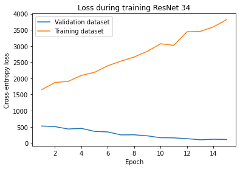
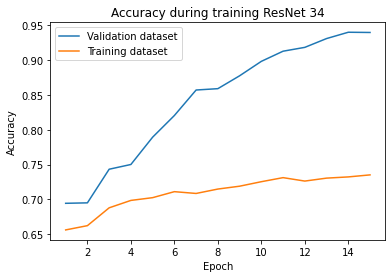
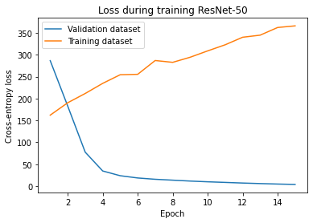
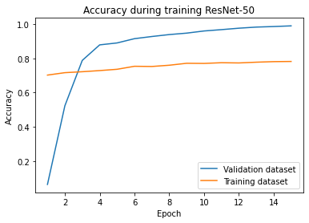
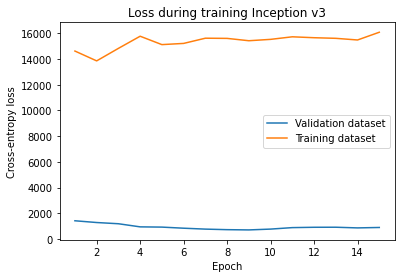
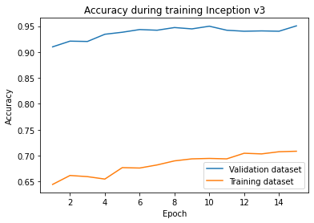
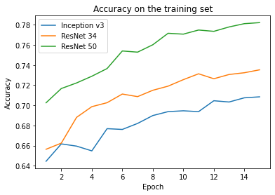

# Dog Breed Identification

*Created by: Armand Mousavi (amousavi@cs), Vivek Patel (vivekp@cs), and Albert Zhong (azhong@cs)*

*UW student project for CSE455 22sp*

## Video

## Abstract and Background

FGIC (Fine-Grained Image Classification) is a core problem in modern machine learning and computer vision. Assigning categorical labels to images is a straightforward problem to explain, but presents a huge challenge when considering the scale and complexity of image data.

Neural networks (and more specifically, convolutional neural networks) are a key tool used in tackling fine-grained image classification problems. A neural network architecture for image classification usually involves taking a preprocessed input and applying square-cropping, rotations and zooms to prevent overfitting. Then the network convolutes, activates, and pools the results to transform the input into a new shape as to learn higher-order features. This smaller portion is then repeated before fully connected layer(s) with a softmax-esque activation function yield output probabilities for label. An example is presented:

[[Source]](https://www.researchgate.net/figure/CNN-architecture-used-to-perform-image-classification-Ant-specimen-photograph-by-April_fig2_322848501)

## Problem Statement

Our goal is to evaluate multiple common image classification networks that are more general on their ability to perform dog breed identification on the [Stanford Dogs Dataset](http://vision.stanford.edu/aditya86/ImageNetDogs/).

## Data Source
We used the [Stanford Dogs Dataset](http://vision.stanford.edu/aditya86/ImageNetDogs/) provided by Kaggle. It features 20,850 images across 120 dog breeds. There are roughly 150 evenly distributed images per dog breed.

## Methodology
1. Gather dataset
2. Preprocess training/validation/testing datasets
    1. Cropping
    2. Flipping
    3. Rotation
3. Experiment with different optimizers and model hyperparameters on validation set
3. Train on training set
4. Evaluate performance on testing set

We compared three common, general models for image classification:
* ResNet-34
* ResNet-50
* Inception-v3

We leveraged pre-trained weights made available by PyTorch, but modified the networks to support predictions across 120 labels (the number of different breeds in the dataset). We removed the fully-connected layers at the end of each network and replaced them with layers that have 120 outputs. From there, our training code takes the argmax over the output layer and uses that label as the final prediction.

## Experimental Setup and Results

The full training and testing code we used to compare the models can be viewed in our Colab notebook [here](https://colab.research.google.com/drive/1n4Donev0PE45W8-coGbfZ-s5n1rdc0x8?usp=sharing).

For each network we trained against the dataset, we generated plots for Training Loss vs. Epoch and Validation Loss vs. Epoch. We utilized a 70-15-15 split for training, validation, and testing. All models were trained for 15 epochs of stochastic gradient descent with a learning rate of 0.01, momentum of 0, and weight decay of 0.0001.

### ResNet-34

On the validation set, cross-entropy loss decreased and accuracy increased in every epoch. The model achieved a high accuracy of 0.940 on the validation set. The model performed worse on the training set, which is expected given that it should be more difficult to generalize a model to a larger dataset. The accuracy of ResNet-34 increased in every epoch on the training set, reaching a final accuracy of 0.735. 

Surprisingly, the loss also increased in every epoch. While loss and accuracy should intuitively be inversely correlated, this scenario is still possible. Accuracy on a dataset just checks if the highest softmax output matches the correctly labeled class. In contrast, cross-entropy loss takes into account how high the softmax output is, which can be seen as how confident the model is on a particular dog breed. Since both accuracy and loss increased on the training set, we interpret this as the model overfitting to the training set. While the model ends up making better final guesses, the "degree" to which it is confident that a dog is a specific breed is faulty.

The model took roughly 30 minutes to train on the training set.

The final test accuracy of ResNet-34 was 0.747, which is actually slightly better than the accuracy on the training set.

### ResNet-50

Like before, the cross-entropy loss decreased and accuracy increased in every epoch on the validation set. The loss decreased more sharply compared to ResNet-34. The model achieved a very high accuracy of 0.99 on the validation set, and an accuracy of 0.782 on the training set. It achieved a final accuracy of 0.815 on the test set. Clearly ResNet-50 performed slightly better than ResNet-34, which makes sense given that ResNet-50 has 50 layers while ResNet-34 only has 34 layers. The training time was nearly the same, only taking 31 minutes to train on the training set.

### Inception-v3

Like before, the cross-entropy loss decreased and accuracy increased in every epoch on the validation set. The loss decreased more slowly compared to other models. The model achieved a very high accuracy of 0.95 on the validation set, and an accuracy of 0.708 on the training set. It achieved a final accuracy of 0.758 on the test set. Inception took roughly 33 minutes to train.

### Results and analysis

| Model        | Validation | Train | Test  |
|--------------|------------|-------|-------|
| ResNet-34    | 0.940      | 0.735 | 0.747 |
| ResNet-50    | 0.990      | 0.782 | 0.815 |
| Inception v3 | 0.950      | 0.708 | 0.758 |

ResNet-50 seemed to perform the best, achieving a final accuracy of 0.815 on the test set. Inception v3 and ResNet-34 both seemed to perform slightly worse, with accuracies of 0.758, 0.747 respectively. All models took roughly 30 minutes to train. Nevertheless, under a different set of hyperparameters and training regimes, this ordering could change.

What is interesting is that the test accuracy was slightly higher than the train accuracy for all three models. This suggests we could have chosen a better split of training versus testing data. In addition, the cross-entropy loss for all three models actually increased during the course of training, yet the accuracy still improved with every epoch. This suggests we could have chosen better hyperparameters, since we should ideally see loss dropping for each epoch.

## Challenges
The main challenge was writing clean code for reshaping the networks' output layers, training, and plotting results with PyTorch and matplotlib.  An additional challenge was fine-tuning model and training hyperparameters (i.e using Adam vs SGD for the optimizer, choice of learning rate, weight decay, momentum, batch size, etc). Even small changes in hyperparameters such as the weight decay induced large variances in model performance.

In particular, Inception v3 required a fair bit of debugging due to the fact that it supplied an auxiliary output layer that we had failed to recognize when we were selecting networks to train. The usual flow for changing the output layer to reflect the number of labels obviously neglected that layer, and as such we needed to change our training code to grab those outputs in order to have the destination variable match the shape of the output coming from the network. Moreover, a separate set of preprocessing transforms needed to be defined as the input sizes to the network were 299 x 299 as opposed to the 227 x 227 that both ResNet models took in.

## Final Thoughts
It's no surprise that the pretrained weights for general image recognition performed well in a generic classification environment. In general, it seems that under controlled hyperparameters of training, deeper architectures such as ResNet-50 with more physical weights that affect classification yield better results. If we were to repeat such an experiment in the future, we'd definitely look into resources for longer training, where we free the weights on the pretrained networks and have gradient descent perturb the weights across the entirety of the networks. In addition, we would spend more time exploring different optimization and regularization techniques (i.e stochastic gradient descent vs. Adam) to prevent over/underfitting.
